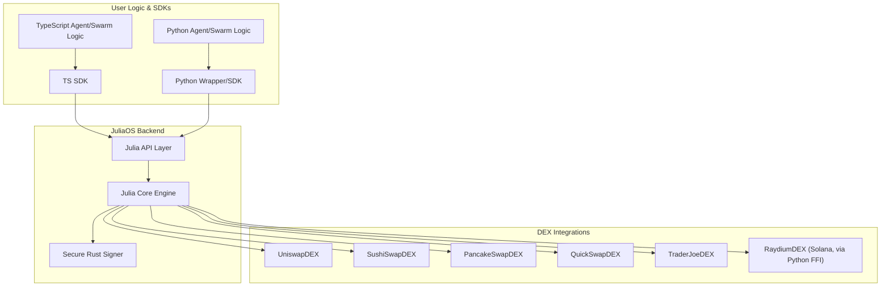

# JuliaOS Open Source AI Agent & Swarm Framework

*joo-LEE-uh-oh-ESS* /ˈdʒuː.li.ə.oʊ.ɛs/

**Noun**
**A powerful multi-chain, community-driven framework for AI and Swarm technological innovation, powered by Julia.**

Translations:
[🇨🇳 汉语](docs/translations/汉语.md) | [🇦🇪 اَلْعَرَبِيَّةُ](/docs/translations/اَلْعَرَبِيَّةُ.md) | [🇩🇪 Deutschland](/docs/translations/Deutschland.md)| [🇫🇷 Français](/docs/translations/Français.md) | [🇮🇹 Italiano](/docs/translations/Italiano.md) | [🇪🇸 Español](/docs/translations/Español.md)


## Overview

JuliaOS is a comprehensive framework for building decentralized applications (DApps) with a focus on agent-based architectures, swarm intelligence, and cross-chain operations. It provides both a CLI interface for quick deployment and a framework API for custom implementations. By leveraging AI-powered agents and swarm optimization, JuliaOS enables sophisticated strategies across multiple blockchains.

## Documentation

- 📖 [Overview](https://juliaos.gitbook.io/juliaos-documentation-hub): Project overview and vision
- 🤝 [Partners](https://juliaos.gitbook.io/juliaos-documentation-hub/partners-and-ecosystems/partners): Partners & Ecosystems
  
### Technical

- 🚀 [Getting Started](https://juliaos.gitbook.io/juliaos-documentation-hub/technical/getting-started): Quick start guide
- 🏗️ [Architecture](https://juliaos.gitbook.io/juliaos-documentation-hub/technical/architecture): Architecture overview
- 🧑‍💻 [Developer Hub](https://juliaos.gitbook.io/juliaos-documentation-hub/developer-hub): For the developer
    
### Features

- 🌟 [Core Features & Concepts](https://juliaos.gitbook.io/juliaos-documentation-hub/features/core-features-and-concepts): Important features and fundamentals
- 🤖 [Agents](https://juliaos.gitbook.io/juliaos-documentation-hub/features/agents): Everything about Agents
- 🐝 [Swarms](https://juliaos.gitbook.io/juliaos-documentation-hub/features/swarms): Everything about Swarms
- 🧠 [Neural Networks](https://juliaos.gitbook.io/juliaos-documentation-hub/features/neural-networks): Everything about Neural Networks
- ⛓️ [Blockchains](https://juliaos.gitbook.io/juliaos-documentation-hub/features/blockchains-and-chains): All blockchains where you can find JuliaOS
- 🌉 [Bridges](https://juliaos.gitbook.io/juliaos-documentation-hub/features/bridges-cross-chain): Important bridge notes and information
- 🔌 [Integrations](https://juliaos.gitbook.io/juliaos-documentation-hub/features/integrations): All forms of integrations
- 💾 [Storage](https://juliaos.gitbook.io/juliaos-documentation-hub/features/storage): Different types of storage
- 👛 [Wallets](https://juliaos.gitbook.io/juliaos-documentation-hub/features/wallets): Supported wallets
- 🚩 [Use Cases](https://juliaos.gitbook.io/juliaos-documentation-hub/features/use-cases): All use cases and examples
- 🔵 [API](https://juliaos.gitbook.io/juliaos-documentation-hub/api-documentation/api-reference): Julia backend API reference

## Quick Start

### Prerequisites

- **Node.js**: Ensure you have Node.js installed. You can download it from [nodejs.org](https://nodejs.org/).
- **Julia**: Ensure you have Julia installed. You can download it from [julialang.org](https://julialang.org/).
- **Python**: Ensure you have Python installed. You can download it from [python.org](https://www.python.org/).

### Creating Agents and Swarms (TypeScript & Python)

#### TypeScript (TS) Agents & Swarms

1. **Install dependencies and build the project:**
   ```bash
   npm install
   npm run build
   ```

2. **Create a new agent or swarm using the provided templates:**
   - Copy and customize the template in `packages/modules/julia_templates/custom_agent_template.jl` for Julia-based agents.
   - For TypeScript agents, use the templates in `packages/templates/agents/` (e.g., `custom_agent_template.jl`, `src/AgentsService.ts`).

3. **Configure your agent or swarm:**
   - Edit the configuration files or pass parameters in your TypeScript code.
   - Use the TypeScript SDK (`packages/core/src/api/ApiClient.ts`) to interact with the Julia backend, create agents, submit objectives, and manage swarms.

4. **Run your agent or swarm:**
   - Use the CLI or your own script to start the agent.
   - Example (TypeScript):
     ```typescript
     import { ApiClient } from '@juliaos/core';
     const client = new ApiClient();
     // Create and run agent logic here
     ```

#### Python Agents & Swarms

1. **Install the Python wrapper:**
   ```bash
   pip install -e ./packages/pythonWrapper
   ```

2. **Create a new agent or swarm using the Python templates:**
   - Use the templates in `packages/templates/python_templates/` (e.g., `orchestration_template.py`, `llm_integration_examples/`).

3. **Configure and run your agent:**
   - Import the Python wrapper and use the client to interact with JuliaOS.
   - Example:
     ```python
     from juliaos_wrapper import client
     api = client.JuliaOSApiClient()
     # Create and run agent logic here
     ```

4. **Submit objectives or manage swarms:**
   - Use the Python API to submit objectives, create swarms, and monitor results.

## Architecture Overview

JuliaOS is built as a modular, multi-layered system for cross-chain, agent-based, and swarm intelligence applications. The architecture is designed for extensibility, security, and high performance, supporting both EVM and Solana ecosystems.

**Key Layers:**

- **User Logic & SDKs**
  - **TypeScript SDK & Logic Layer:**  
    - Location: `packages/core/`, `packages/templates/agents/`
    - Users write agent and swarm logic in TypeScript, using the SDK to interact with the Julia backend.
  - **Python Wrapper/SDK & Logic Layer:**  
    - Location: `packages/pythonWrapper/`, `packages/templates/python_templates/`
    - Users write agent and orchestration logic in Python, using the wrapper to interact with JuliaOS.

- **JuliaOS Backend**
  - **Layer 1: Julia Core Engine (Foundation Layer):**  
    - Location: `julia/src/`
    - Implements core backend logic: agent orchestration, swarm algorithms, neural networks, portfolio optimization, blockchain/DEX integration, price feeds, storage, and trading strategies.
  - **Layer 2: Julia API Layer (Interface Layer, MCP-Enabled):**  
    - Location: `julia/src/api/`
    - Exposes all backend functionality via API endpoints (REST/gRPC/MCP), validates and dispatches requests, formats responses, and enforces API-level security.
  - **Layer 3: Rust Security Component (Specialized Security Layer):**  
    - Location: `packages/rust_signer/`
    - Handles all cryptographic operations (private key management, transaction signing, HD wallet derivation) in a secure, memory-safe environment, called via FFI from Julia.

- **DEX Integrations**
  - Modular DEX support for Uniswap, SushiSwap, PancakeSwap, QuickSwap, TraderJoe (EVM), and Raydium (Solana) via dedicated modules in `julia/src/dex/`.
  - Each DEX module implements the AbstractDEX interface for price, liquidity, order creation, trade history, and token/pair discovery.

- **Risk Management & Analytics**
  - Global risk management is enforced via `config/risk_management.toml` and `julia/src/trading/RiskManagement.jl`.
  - Real-time trade logging and analytics are provided by `julia/src/trading/TradeLogger.jl`, outputting to both console and file.

- **Community & Contribution**
  - Open-source, community-driven development with clear contribution guidelines and modular extension points for new agents, DEXes, and analytics.

**Architecture Diagram:**



## 🧑‍🤝‍🧑 Community & Contribution

JuliaOS is an open-source project, and we welcome contributions from the community! Whether you're a developer, a researcher, or an enthusiast in decentralized technologies, AI, and blockchain, there are many ways to get involved.

### Join Our Community

The primary hub for the JuliaOS community is our GitHub repository:

* **GitHub Repository:** [https://github.com/Juliaoscode/JuliaOS](https://github.com/Juliaoscode/JuliaOS)
    * **Issues:** Report bugs, request features, or discuss specific technical challenges.
    * **Discussions:** (Consider enabling GitHub Discussions) For broader questions, ideas, and community conversations.
    * **Pull Requests:** Contribute code, documentation, and improvements.

### Ways to Contribute

We appreciate all forms of contributions, including but not limited to:

* **💻 Code Contributions:**
    * Implementing new features for agents, swarms, or neural network capabilities.
    * Adding support for new blockchains or bridges.
    * Improving existing code, performance, or security.
    * Writing unit and integration tests.
    * Developing new use cases or example applications.
* **📖 Documentation:**
    * Improving existing documentation for clarity and completeness.
    * Writing new tutorials or guides.
    * Adding examples to the API reference.
    * Translating documentation.
* **🐞 Bug Reports & Testing:**
    * Identifying and reporting bugs with clear reproduction steps.
    * Helping test new releases and features.
* **💡 Ideas & Feedback:**
    * Suggesting new features or enhancements.
    * Providing feedback on the project's direction and usability.
* ** evangelism & Advocacy:**
    * Spreading the word about JuliaOS.
    * Writing blog posts or creating videos about your experiences with JuliaOS.

### Getting Started with Contributions

1.  **Set Up Your Environment:** Follow the [Quick Start](#quick-start)
2.  **Find an Issue:** Browse the [GitHub Issues](https://github.com/Juliaoscode/JuliaOS/issues) page. Look for issues tagged with `good first issue` or `help wanted` if you're new.
3.  **Discuss Your Plans:** For new features or significant changes, it's a good idea to open an issue first to discuss your ideas with the maintainers and community.
4.  **Contribution Workflow:**
    * Fork the [JuliaOS repository](https://github.com/Juliaoscode/JuliaOS) to your own GitHub account.
    * Create a new branch for your changes (e.g., `git checkout -b feature/my-new-feature` or `fix/bug-description`).
    * Make your changes, adhering to any coding style guidelines (to be defined, see below).
    * Write or update tests for your changes.
    * Commit your changes with clear and descriptive commit messages.
    * Push your branch to your fork on GitHub.
    * Open a Pull Request (PR) against the `main` or appropriate development branch of the `Juliaoscode/JuliaOS` repository.
    * Clearly describe the changes in your PR and link to any relevant issues.
    * Be responsive to feedback and participate in the review process.

### Contribution Guidelines

We are in the process of formalizing our contribution guidelines. In the meantime, please aim for:

* **Clear Code:** Write readable and maintainable code. Add comments where necessary.
* **Testing:** Include tests for new functionality and bug fixes.
* **Commit Messages:** Write clear and concise commit messages (e.g., following Conventional Commits).

We plan to create a `CONTRIBUTING.md` file with detailed guidelines soon.

### Code of Conduct

We are committed to fostering an open, welcoming, and inclusive community. All contributors and participants are expected to adhere to a Code of Conduct. We plan to adopt and publish a `CODE_OF_CONDUCT.md` file (e.g., based on the Contributor Covenant) in the near future.

